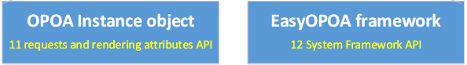

# EasyOPOA 框架API

**EasyOPOA框架秉持Easy的核心思想，为了保证对开发人员的友好，API非常简单，仅暴漏了有限的几个功能性API。**

EasyOPOA框架的API主要分为两类：

**1. OPOA实例（OPOA Instance）定义属性（11个）**

 创建OPOA实例的属性API。EasyOPOA以Hash动作实例为框架核心，OPOA实例是Hash动作实例的三大组成元素（hash，url，OPOAInstance）之一。

**2. EasyOPOA框架API（12个）**

 系统级的全局API。


-----------------

## 1、OPOA实例（OPOA Instance）定义属性
 在OPOA程序中，每一个触发的动作都需要对应一个OPOA实例，多个动作可对应同一个OPOA实例。在进行加载时，必须提前创建OPOA实例。

> OPOA实例（OPOA Instance）是Hash动作实例的组成部分之一。定义了当动作执行时，对url请求加载、渲染页面的方式和细节参数。


一个OPOA实例对象包含了十一个与Ajax请求和页面渲染相关的属性：`actions`、`show`、`hash`、`url`、`find`、`notfound`、`method`、`prevent`、`actionMaps`、`urlErrors`、`loading`。部分属性具有默认值，可根据需要定义或修改相应属性。如果需要修改OPOA全局默认定义，可参考`EasyOPOA.Configs`参数。

- ### opoa实例默认定义：

<input type="button" value="test" onclick="alert(window.document.body.innerHTML)"/>
 ```JS
 var opoa = {  
	// jQuery的DOM选择器，让DOM具有动作触发能力，自动创建Hash动作实例
	// 单击（click）该DOM元素时即会触发一个Hash动作实例
	// （可从选择的DOM中获得'Hash动作实例'所需的hash,url）
	// （结合当前opoa实例，自动创建DOM点击时触发的'Hash动作实例'）
	// 例如，通过该参数选择菜单选项，让OPOA程序的菜单选项能够触发Hash动作实例
	"actions" : null,
	// jQuery的DOM选择器，显示从请求的url加载到的内容
	// 将动作请求url返回的结果显示到选择器指定的区域
	"show" : null,
	// 从DOM节点中获取'Hash动作实例'的hash值的DOM属性名称
	// 默认值：hash
	"hash" : "hash",
	// 从DOM节点中获取'Hash动作实例'的url值的DOM属性名称
	// 默认值：hash (url值默认也等同于hash值)
	"url":"hash",
	// 从服务器获得的数据中，利用find指定的jQuery DOM选择器筛选出指定区域的数据
	// 例如，从服务器中返回的数据中仅获取某个DIV中的内容
	"find" : null,
	// 当find参数的选择器，没有从服务器返回的数据中找到内容时，显示的内容
	// 可选值为"empty","all","自定义内容",function
	// "empty" 显示空内容
	// "all" 显示加载到的所有数据
	// "自定义内容" 将自定义内容的内容显示(可使用消息或图片提示用户)
	// function 执行该函数
	// 默认值：empty
	"notfound" : "empty",
	// 对url进行Ajax请求的具体方式 ：post/get
	// post方式会自动将url请求后的参数转换为post参数发送
	// 默认值：post
	"method" : "post",
	// 阻止默认事件动作。如A标签点击时不触发href
	"prevent" : true,
	// 使用actionMaps修改指定hash对应的默认url为其他值
	// Hash动作映射的`opoaInstance`默认即为当前opoa对象this
	"actionMaps" : {
		// "hash":"url"，
		// "demo":"demo.jsp"
	},
	// 当对url的请求从服务器端返回错误代码时，如何处理
	// 一组数值的HTTP代码和函数对象，当响应时调用了相应的代码。
	"urlErrors" : {
		// 如果执行的动作发生404错误时，如何处理
		// 默认：如果发生404加载错误，页面不会有任何响应
		404 : function() {
		},
		// 如果执行的动作发生500错误时，如何处理
		// 默认：如果发生500加载错误，页面不会有任何响应
		500 : function() {
		}
		// 也可定义其他状态
	},
	// 在ajax请求的不同状态时分别调用的函数，可用来进行loading提示
	"loading" : {
		// ajax请求开始
		"start" : function(hash, url, opoa, postData) {
		},
		// ajax请求成功
		"success" : function(hash, url, opoa, postData) {
		},
		// ajax请求出错
		"error" : function(hash, url, opoa, postData) {
		},
		// ajax请求结束（无论成功失败都会调用）
		"end" : function(hash, url, opoa, postData) {
		}
	}
};
 ```

- ### OPOA实例创建示例：

 ```JS
// opoa实例
var opoa = {
	"actions" : "#menuDIV .menu",
	"show" : "#contentDIV"
};
```

## 2. EasyOPOA框架API

EasyOPOA框架暴漏了12个系统级的全局API。


 - ### EasyOPOA.Configs 
 
 `EasyOPOA.Configs`保存了OPOA实例属性全局的默认值。OPOA实例配置参数的全局默认值，均可以通过`EasyOPOA.Configs`来重新设置。

 > 示例：
 >  ```JS	
> // 如果从服务器返回的数据中没有找到find指定的内容，则显示所有
> EasyOPOA.Configs.notFound="all";
> // 获取url值的DOM属性
> EasyOPOA.Configs.url="href";
	...
```


 - ### EasyOPOA.cookieLast
```JS 
 = boolean：true || false
```
 利用cookie，开启动作定位的记忆功能(依赖jquery.cookie.js和json2.js),能够记录最后访问的动作，实现OPOA动作恢复。

 默认值：false。


- ### EasyOPOA.start
```JS 
 = function(opoaList, [actionMaps])
```
 核心方法，启动EasyOPOA。

 函数可传入两个参数：opoaList（OPOA实体配置集合）、actionMaps（hash动作映射对象列表）。

 >  actionMaps支持三种形式的参数：标准映射对象、基于标准对象的数组参数列表、基于数组对象的列表。
> 				
> - **启动时，传入标准动作映射对象：**
> 
> ```JS
> //标准动作映射对象
> var actionMap={"demo":[ "demo.jsp" ,opoaList.menu]};
> 
> //使用opoaList和actionMaps启动
> EasyOPOA.start(opoaList,actionMap);
> ```
> 
> - **启动时，传入数组列表参数（基于标准映射对象）：**
> 
> ```JS
> var actionMaps=[
> 	// 基于标准动作映射对象
> 	// {hash: [ url, opoaInstance ]}
> 	{"demo" : [ "demo.jsp" ,opoaList.menu]},
> 	{"readme" : [ "readme.jsp",opoaList.menu ]}
> ];
> 
> //使用opoaList和actionMaps启动
> EasyOPOA.start(opoaList,actionMap);
> ```
> 
> - **启动时，传入数组列表参数（基于数组对象）：**
> 
> ```JS
> var actionMaps2=[
> 	// 基于数组
> 	// [hash, url, opoaInstance]
> 	["demo", "demo.jsp", opoaList.menu],
> 	["readme", "readme.jsp", opoaList.menu]
> ];
> 
> //使用opoaList和actionMaps启动
> EasyOPOA.start(opoaList,actionMap2);
> ```

- ### EasyOPOA.notHash
```JS
 = function([hash])
```
 如果用户请求的hash未注册不存在时的处理函数（如用户保存的书签已经失效或不存在）。

 函数可传入一个参数：用户访问的无效hash名称。


 - ### EasyOPOA.addActionMap :
```JS
  = function(hash, url, opoa)
```
 addActionMap(hash,url,opoa)函数可添加一个新的自定义hash动作映射。

 函数可传入三个参数：自定义hash名称、自定义url、自定义opoa实例。


 - ### EasyOPOA.addActionUrlErrors :
```JS
  = function(hash, urlErrorsObject) 
```
 addActionUrlErrors(hash, urlErrorsObject)函数为hash动作定义HTTP代码响应对象。

 函数可传入两个参数：hash名称、HTTP代码响应对象。

 >   **HTTP代码响应对象：**
> 等同jQuery的Ajax状态处理参数statusCode。
>
>  ```JS
> {
>     //http代码 : 处理函数
> 	404:function(){},
> 	500:function(){}
> }
> ```

- ### EasyOPOA.addActionLoadings
```JS
 = function(hash, loadingObject)
```
 addActionLoadings(hash, loadingObject)函数为hash动作指定loading处理对象。

 函数可传入两个参数：hash名称、loading处理对象。

 >   **loadingObject对象：**
>   
> loadingObject处理对象包含4个loading状态：开始，成功，出错，结束。
> 不强迫要求同时定义4个状态，定义时，可根据需要仅定义部分。
>
>  ```JS
{
	//ajax请求开始
	"start":function(hash, url, opoa, postData){},
	//ajax请求成功
	"success":function(hash, url, opoa, postData){},
	//ajax请求出错
	"error":function(hash, url, opoa, postData){},
	//ajax请求结束（无论成功失败都会调用）
	"end":function(hash, url, opoa, postData){}
}
> ```


- ### EasyOPOA.home
```JS
 = function(hash, [postData])
```
 通过hash名称动态加载首页。

 函数可传入两个参数：hash名称、提交到服务器的数据postData。


- ### EasyOPOA.homeUrl
```JS
 = function(url, opoaInstance, [postData])
```
 通过url动态加载首页。

 函数可传入两个参数：url、opoaInstance、提交到服务器的数据postData。


- ### EasyOPOA.homeFun
```JS
  = function()
```
 当OPOA没有从Ajax加载首页时，默认显示首页的处理函数。
 主要用于首页为静态内容的场景下，浏览器后退到首页时，首页静态内容无法更新问题。可在此函数中设置静态首页显示的内容。

 > 示例：
 >  ```JS
> EasyOPOA.homeFun=function(){
> 	$("#contentDIV").html("<h1>欢迎使用！</h1>");
> }
> ```


- ### EasyOPOA.load
```JS
 = function(hash, [postData])
```
 通过hash动作名称，手动进行加载。

 函数可传入两个参数：hash名称、提交到服务器的数据postData。


- ### EasyOPOA.noConflict
```JS
 = function([deep])
```
 noConflict函数，将变量EasyOPOA和OPOA的控制权让渡给第一个实现它的那个库。
				
 函数可传入一个参数：deep（为空或false仅释放OPOA命名空间， 为true 将完全释放EasyOPOA和OPOA命名空间）。

 > 示例：
 > 运行这个函数将变量`OPOA`的控制权让渡给第一个实现它的那个库。
> ```JS
> var $OPOA=EasyOPOA.noConflict();
> ```
> 
> 运行这个函数将变量`OPOA`和`EasyOPOA`的控制权让渡给第一个实现它的那个库。
> ```JS
> var $OPOA=EasyOPOA.noConflict(true);
> ```

## 结束


如果您有更好意见，建议或想法，请联系我。


[在线Demo](http://www.easyproject.cn/easyopoa/zh-cn/index.jsp#demo '在线 Demo')

联系、反馈、定制、培训 Email：<inthinkcolor@gmail.com>


<p>
<strong>支付宝钱包扫一扫捐助：</strong>
</p>
<p>

</img>
